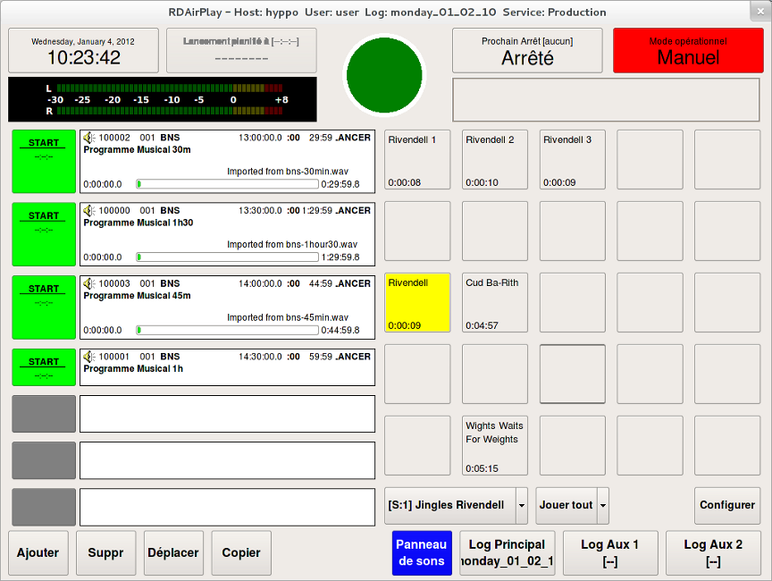
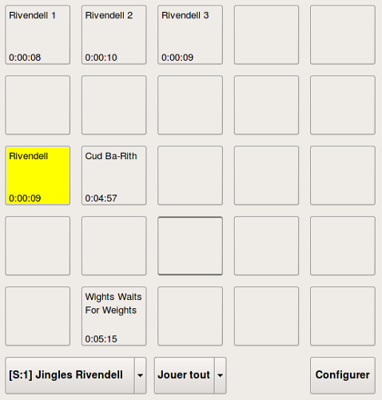
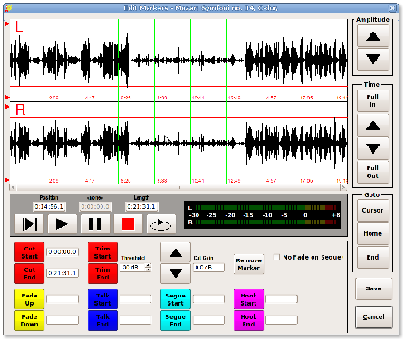

!SLIDE center
# Rivendell #
## Libérez votre antenne ##

!SLIDE bullets incremental
# Préambule #

## Logiciels libres pour les radios libres ##

* Montage
* Streaming
* Pige
* Diffusion Web
* ...

!SLIDE bullets incremental
# Préambule #

## What else ? ##

!SLIDE bullets center
# Rivendell #

## Gestion d'antenne radiophonique ##

* **D**iffusion
* Logiciel libre

!SLIDE bullets
# Rivendell #

## Créé, maintenu par Fred Gleason

* initialement chez Salem Radio Labs
* actuellement Paravel Systems

!SLIDE bullets
# Rivendell #

## Historique

* Avril 2002 : Début du projet
* Juin 2004 : Support Jack
* Septembre 2004 : Premier déploiement
* 2010 : version 1.7.2
* version 2 en test

!SLIDE bullets incremental

# Fonctionnalités principales #

* Diffusion : direct ou automatique
* Multiposte
* Gestion des diffusables
* Gestion des logs/playlists
* Administration complète

!SLIDE bullets incremental

# Ce que Rivendell n'est pas #

* Pas installable “comme” OpenOffice
* Pas la première chose à installer
* Pas utilisable sans écran
* Pas vraiment utile sans “studio”
* Pas un streamer

!SLIDE bullets 

# Prérequis - Matériel #

## Ordinateur récent ##

* Unité centrale : 500 €
* Ecran(s), option (couteuse) : tactile

!SLIDE bullets 

# Prérequis - Matériel #

## Carte son “prolixe” ##

* Compatible ALSA
* M-Audio, ..., ASI, ..., Sound Blaster
* En LiveAssist : jusqu'à 14 voies

!SLIDE bullets 

# Prérequis - Logiciel #

* Linux: Debian, Ubuntu, Suse, …

* Pas de license payante : GPL

!SLIDE bullets incremental

# Prérequis #

## De la compétence ##

* ALSA, Jack,
* stockage, base de données, 
* sauvegardes, 
* réseau, NFS, ...

## Du temps ##

!SLIDE center

# RdAirPlay #
## Diffusion ##

!SLIDE full-page

!SLIDE bullets

# RdAirPlay #
## Diffusion ##

* Assistance au direct
* Diffusion automatique

!SLIDE bullets

#RdAirPlay - SoundPanel#

## Lancer ##

* les jingles
* des commandes

## Sorties dédiées ##

!SLIDE bullets

#RdAirPlay - SoundPanel#

##  Configurable ##

* Par Utilisateur
* Par Service

!SLIDE bullets

#RdAirPlay – Live Assist#

## Tout ##

* Musique, jingles, PAD, …
* Cart
* Manual / Live Assist

!SLIDE bullets

#RdAirPlay – Live Assist#

* Plusieurs sorties audios
* Pré-écoute
* Ecran tactile

!SLIDE bullets

#RdAirPlay – Automatique#

* Meme interface

* Charger un Log 
* Préparé directement ou à part

!SLIDE bullets

#RdAirPlay – Automatique#

* Transitions, enchainements
* Contraintes horaires
* Lancement de macros
* Jusqu'à 3 logs en parallèle
* Sorties audios dédiées possibles

!SLIDE bullets

# RdLibrary #

## Edition des Carts

* Cart : les diffusables
* Cut : les sons

!SLIDE bullets

# RdLibrary - Carts #

##  Diffusable

* Number
* Titre
* Group
* *n* Cuts

!SLIDE bullets

# RdLibrary - Carts #

## Metadonnées

* Titre
* Artiste, Year
* Groupe, Scheduler Codes
* Client, Agency

!SLIDE bullets

# RdLibrary - Cuts #

## Son

* Description, Origin
* Stats de diffusion
* Périodes d'utilisation
* Enregistrement

!SLIDE bullets

# RdLibrary - Cuts #

## Marques

* Début/Fin
* Fade
* Talk
* Segue

## Trim Début/Fin

!SLIDE bullets

# RdLibrary - Import #

* Fichiers (conversion)
* CD complet ou partiel
* Métadonnées

!SLIDE bullets

# Import #

## Traitement

* Conversion
* Normalisation
* Trim Automatique
* Stockage

!SLIDE bullets

# Import - DropBoxes #

* Imports automatiques
* Détection de fichiers dans un répertoire

## Paramètres prédéfinis

* Utilisation du nom du fichier
* Group
* Normalisation

!SLIDE bullets

# RdLogEdit

## Edition des Logs

* Manuels
* Automatiques

## Gestion 

* Transitions
* Contraintes horaires

!SLIDE smbullets

# Autres fonctionnalités

* Programmation automatique
* Enregistrements
* Gestion logins utilisateurs
* GPIOs, switchs
* Download, upload
* Voicetracking
* Now & Next
* Support de Twitter
* Podcasts
* Backup
* ...

!SLIDE bullets

# RdAdmin

* configuration centralisée
* toutes les stations (*hosts*)
* plusieurs services

!SLIDE bullets

# RdAdmin

* Host
* Group & Scheduler Codes
* Reports
* Backups
* User
* Service

!SLIDE bullets

# RdAdmin - Host

## Configuration des applications 

* pour chaque Host
* RdAirPlay, RdCatch, …
* Imports automatiques
* ...

!SLIDE bullets

# RdAdmin - Host

## Configuration matérielle

* Entrées/Sorties Audio
* GPIOs, Switchs, ...

!SLIDE bullets

# Premières Questions

* Questions ?

!SLIDE bullets

# RdLogManager

## Génération des logs

* Grid
* Clock
* Event

!SLIDE bullets

# RdCatch

## Tâches planifiées

* Enregistrements programmés
* Download / Upload
* Multi-tâches
* Réactions à des événéments : GPIO ou Macro

!SLIDE bullets

# Macros

## Gèrent

* RdAirplay : chargement de logs
* Switchs, GPIOs
* RdCatch : enregistrements
* Autres : messages, commandes externes, …

!SLIDE bullets

# Macros

## Se programme dans un diffusable

* Dans un log
* Dans un bouton du SoundPanel

!SLIDE bullets

# Podcasts

* Administration centralisée
* Définitions des feeds
* Utilisation directe des Carts

## Concretrement :

* Compression et upload via RdCatch
* Mise à jour des fichiers RSS

!SLIDE bullets

# Documentation

## Rivendell Operations Guide

* “très” complet
* 140 pages (anglais)
* Écrit et maintenu par Fred Gleason

!SLIDE bullets

# Documentation

## Wiki

* très riche
* participatif

## Listes de discussion

* RDD (anglais)
* rivendell-fr

!SLIDE bullets

# Communauté française

* Française, Belge, ...

## Liste de discussion

* rivendell-fr@lists.tryphon.org

## Channel IRC

* \#rivendell-fr

!SLIDE bullets

# Communauté française

## Traductions

* Interfaces
* Operations Guide
* Wiki

## A relancer

!SLIDE bullets

# Modèle “économique”

## Dépenses

* Du temps
* Trouver les bons conseils

## Recettes

* Maitrise de votre système
* Intégration sur mesure

!SLIDE bullets

# Installation

## Configuration classique

* Station studio
* Station administration
* Serveur de stockage (NAS)

## Conçu pour gérer plusieurs studios

!SLIDE bullets

# Installation

## Mise en place

* selon compétences et organisation
* selon état de l'informatique et du réseau
* selon objectifs : vitesse ou maitrise ?

!SLIDE bullets

# Extensions

* Streaming
* Pige
* Mastering
* Intégration Jack
* Duplex entre studios
* Call Commander

!SLIDE bullets

# Questions

## Pour continuer la discussion

* rivendell-fr@lists.tryphon.org
* radio-logiciel-libre@lists.tryphon.org
* http://www.tryphon.eu

  
   
  Rivendell - Libérez votre antenne par <a xmlns:cc="http://creativecommons.org/ns#" href="http://tryphon.eu" property="cc:attributionName" rel="cc:attributionURL">Tryphon</a>
   
  Mis à disposition selon les termes de la <a rel="license" href="http://creativecommons.org/licenses/by-nc-sa/3.0/">licence Creative Commons by-nc-sa 3.0</a>.

